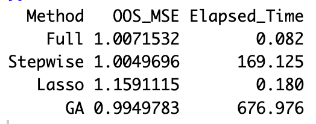
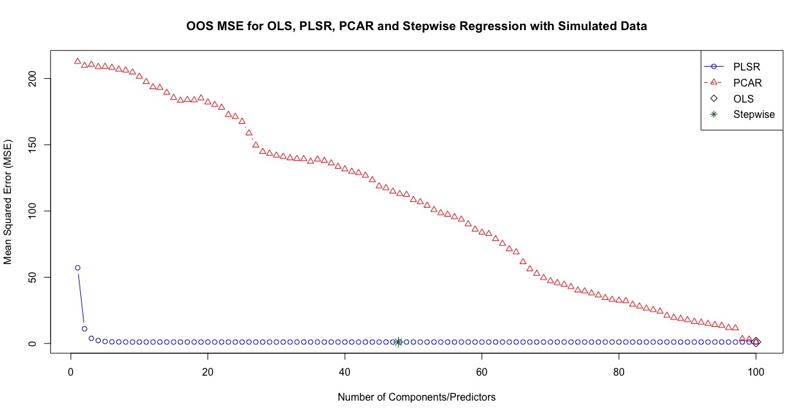
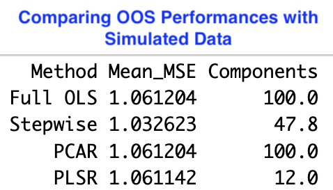
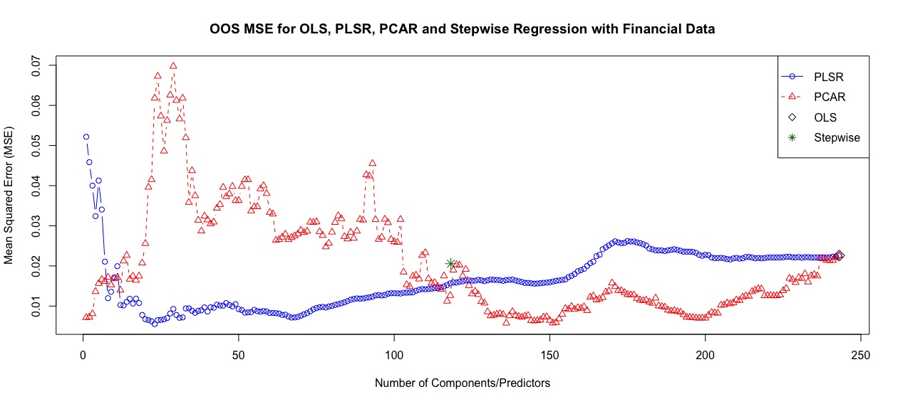
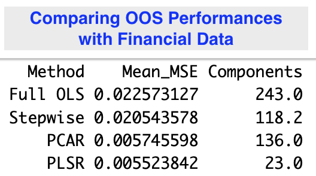

# Out of Sample Performances for different methods to handle high dimensionality: 

### Stepwise Regression, Lasso Regularization and Genetic Algorithm (Fake Data) 

### Stepwise Regression, PCA, PLS: 10-fold Cross-Validation (Fake Data) 

### Stepwise Regression, PCA, PLS: Time Series (Real-World Financial Data)

